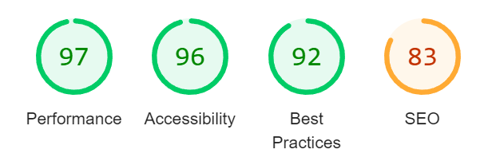

# Welcome to my Project 1 README page

## [My Project 1](http://project1.dazl.ie)

Hi! My name is Graham. In this README page were you will find out a little about me, my website, my coding journey, my projects and who has influenced me in the development of this website.

## My Project Overview.

When thinking of an idea for this project I had many idea's and options, as a history buff I choose the Royal House of Tudor as its covers some of my favourite Monarchs and storylines. I hope you enjoy.

## Project Location

All my projects are also available to view on my portfolio website.
[www.dazl.ie](http://project1.dazl.ie)

## Validator Testing
<ul>
<li>HTML <ul style="list-style-type:circle"><li>No errors returned on W3C HTML validator</li></ul>
</li>
<li>CSS <ul style="list-style-type:circle"><li>No errors returned on W3C CSS validator</li></ul>
</li>
<li>Accessibility <ul style="list-style-type:circle"><li>On website inspection, lighthouse results are shown below</li></ul>
</li>
</ul>

## Tools

As well as the Code Institute course content, I got inspiration from some
online tutorials and video's and also books such as  books from Mike McGraths and video tutorials from Mike Dane.

# Course

## Professional Diploma in Full Stack Software Development
### University College Dublin [Website](https://www.ucd.ie/professionalacademy/why-ucd-professional-academy/)

### Code Institute [Website](https://codeinstitute.net/ie/full-stack-software-development-diploma/?utm_term=code%20institute&utm_campaign=CI+-+IRL+-+Search+-+Brand&utm_source=adwords&utm_medium=ppc&hsa_acc=8983321581&hsa_cam=14304747355&hsa_grp=128775288169&hsa_ad=595155717776&hsa_src=g&hsa_tgt=kwd-342001843376&hsa_kw=code%20institute&hsa_mt=p&hsa_net=adwords&hsa_ver=3&gclid=Cj0KCQjwnvOaBhDTARIsAJf8eVOdV0BAxB5DwdTrFB9AvR5tJ73tLtvCsSeHDsSSq9e1gNbiXiNLTZQaAkyKEALw_wcB)

# Books

### Mike McGrath - HTML, CSS & Javascript (Special Edition) [Amazon](https://www.amazon.co.uk/HTML-CSS-JavaScript-easy-steps/dp/184078878X/ref=asc_df_184078878X/?tag=googshopuk-21&linkCode=df0&hvadid=430989472982&hvpos=&hvnetw=g&hvrand=4859645684734044070&hvpone=&hvptwo=&hvqmt=&hvdev=c&hvdvcmdl=&hvlocint=&hvlocphy=20487&hvtargid=pla-921516488553&psc=1&th=1&psc=1&tag=&ref=&adgrpid=97419294662&hvpone=&hvptwo=&hvadid=430989472982&hvpos=&hvnetw=g&hvrand=4859645684734044070&hvqmt=&hvdev=c&hvdvcmdl=&hvlocint=&hvlocphy=20487&hvtargid=pla-921516488553)

### Jon Duckett - HTML & CSS, design and build websites [Amazon](https://www.amazon.co.uk/HTML-CSS-Design-Build-Websites/dp/1118008189/ref=asc_df_1118008189/?tag=googshopuk-21&linkCode=df0&hvadid=310831942794&hvpos=&hvnetw=g&hvrand=9245307914514372249&hvpone=&hvptwo=&hvqmt=&hvdev=c&hvdvcmdl=&hvlocint=&hvlocphy=20487&hvtargid=pla-425752469964&psc=1&th=1&psc=1)

# Influences

### Mike Dane [Website](https://www.mikedane.com/) [YouTube](https://www.youtube.com/c/GiraffeAcademy)

### TiffinTech [Youtube](https://www.youtube.com/c/TiffInTech/about)

# External Links

### [Wikipedia](https://en.wikipedia.org)
### [History.com](https://www.history.com)
### [Britannica](https://www.britannica.com)
